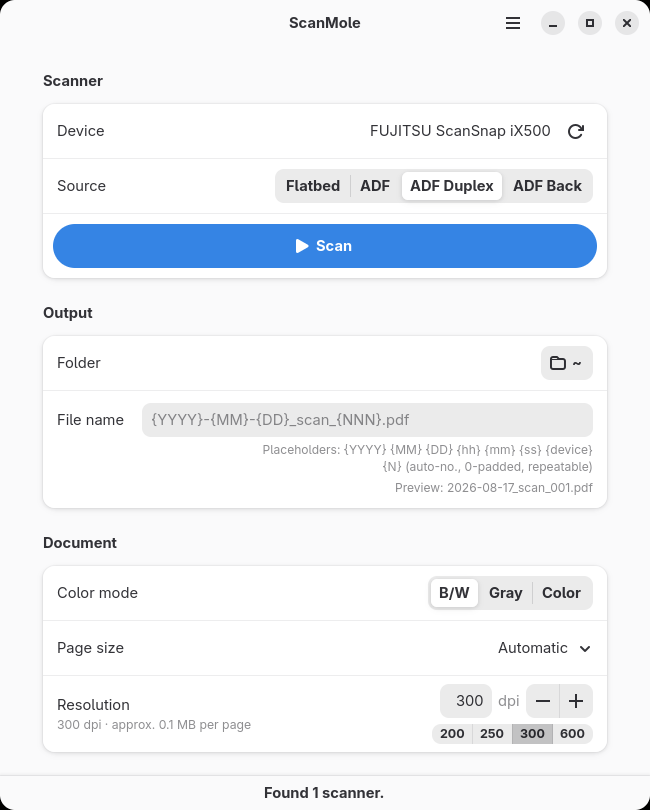
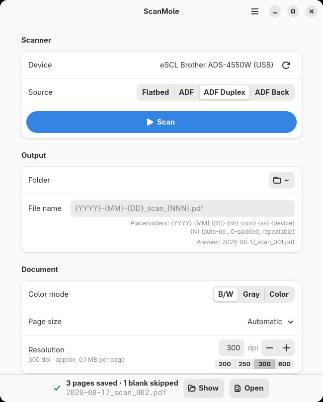
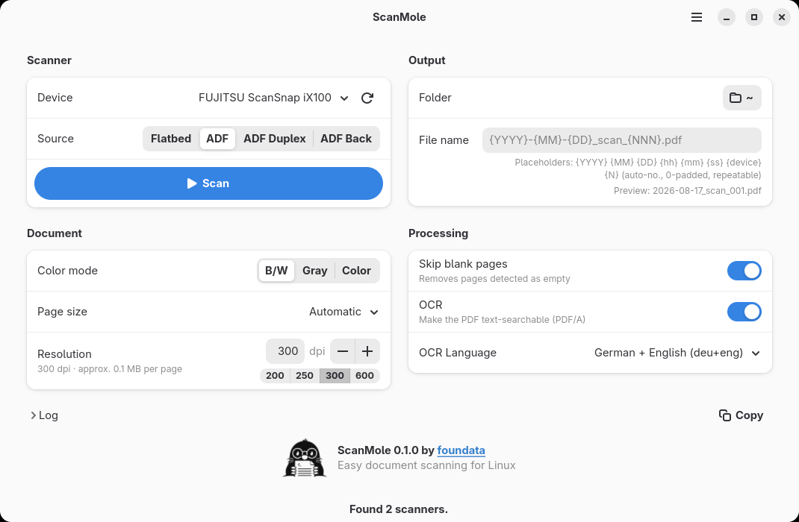
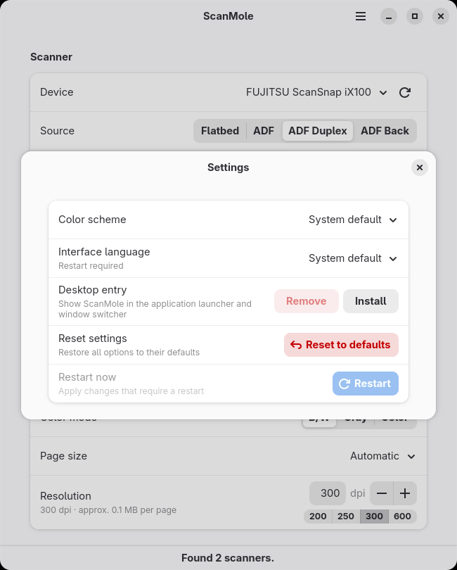
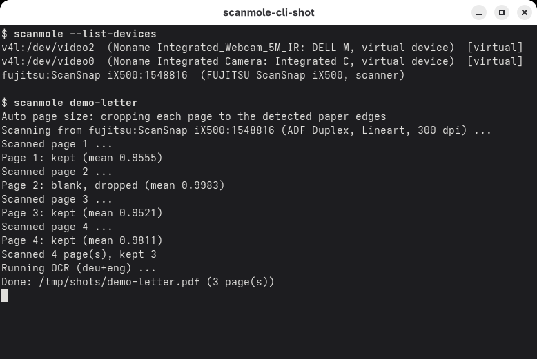

# ScanMole

**Easy, scriptable document scanning for Linux: ADF duplex batches in, searchable (OCRed) PDFs out.**

It consists of two components, shipped as two Python packages, so servers and scripts can install the CLI alone while desktops get the whole experience:

1. **`scanmole`**: CLI scanning engine.
2. **`scanmole-gui`**: GTK4/libadwaita frontend (depends on `scanmole`). A thin subprocess wrapper around the CLI using its `--json` event protocol; it contains no scanning logic itself.


<div align="center" id="project-readme-header">
<br>
<br>


<br>
<br>

**⭐ Found this useful? Support open-source and star this project:**

[](https://github.com/foundata/scanmole)

<br>
</div>


## Table of contents<a id="toc"></a>

- [Features](#features)
- [Demo](#demo)
  - [Screenshots](#demo-screenshots)
- [Installation](#installation)
  - [Debian/Ubuntu](#installation-debian)
  - [Fedora](#installation-fedora)
  - [Device-specific notes](#installation-devices)
  - [Tested devices](#installation-tested-devices)
- [Usage](#usage)
  - [Command Line Interface (CLI)](#usage-cli)
  - [The GUI](#usage-gui)
  - [Exit codes](#usage-exit-codes)
  - [The `--json` protocol](#usage-json)
- [FAQ](#faq)
  - [What to do if my scanner is not listed?](#faq-scanner-not-listed)
  - [What to do if my scanner isn't working as expected?](#faq-scanner-quirks)
  - [How can I optimize the PDF file size?](#faq-file-size)
  - [Why is a page missing from my PDF, or a blank page kept?](#faq-blank-pages)
- [Contributing](#contributing)
- [Licensing, copyright](#licensing-copyright)
  - [Trademarks](#trademarks)
- [Author information](#author-information)


## Features<a id="features"></a>

Main features:

- **Scan a stack of paper into one searchable PDF with a single command:** duplex batch, blank backsides dropped, OCR text layer, archival PDF/A output by default.
- **Automatic page size detection crops every page to the paper's real edges**, so receipts come out receipt-sized and mixed stacks need no set-up.
- **Small files by default:** 1-bit black-and-white at 300 dpi lands at roughly 100 KB per A4 text page, and ocrmypdf shrinks that further where `jbig2enc` is installed.
- **Works with anything [SANE](https://en.wikipedia.org/wiki/Scanner_Access_Now_Easy)** can drive, including driverless eSCL devices via `sane-airscan`. Device capabilities are probed and mapped instead of hardcoded, and devices without a native 1-bit mode get software binarization automatically.
- **Automation-grade CLI** with defined exit codes, filename templates and a versioned JSON event protocol; interrupted batches can be rebuilt from the preserved page images without rescanning the paper.
- **Easy-to-use GTK4/libadwaita GUI** on top of the same engine, with a live filename preview and translations (German included).


## Demo<a id="demo"></a>

### Screenshots<a id="demo-screenshots"></a>

[](./assets/images/screenshots/scanmole-gui-01-main.png)
&#160;
[](./assets/images/screenshots/scanmole-gui-02-scan-result.png)
&#160;
[](./assets/images/screenshots/scanmole-gui-03-two-column.png)
&#160;
[](./assets/images/screenshots/scanmole-gui-04-settings.png)
&#160;
[](./assets/images/screenshots/scanmole-cli-01-scan.png)


## Installation<a id="installation"></a>

[](https://pypi.org/project/scanmole/)
[](https://pypi.org/project/scanmole-gui/)

ScanMole needs Python ≥ 3.12. Its two packages are available on PyPI: [`scanmole`](https://pypi.org/project/scanmole/) (the CLI) and [`scanmole-gui`](https://pypi.org/project/scanmole-gui/) (the desktop frontend, pulls the CLI automatically).

**Desktop (CLI + GUI), using [`uv`](https://docs.astral.sh/uv/getting-started/installation/) (recommended):** the GUI uses the distribution's PyGObject/GTK (see the packages below), so its virtualenv must see the system site packages:

```sh
uv venv --system-site-packages ~/.venvs/scanmole
source ~/.venvs/scanmole/bin/activate
uv pip install scanmole-gui
```

Tip: after the first `scanmole-gui` start, the settings dialog can install a menu entry, so later starts come straight from the desktop's application grid without any venv activation.

**Server or scripting (CLI only):** the CLI is pure stdlib and installs into any isolated environment:

```sh
uv tool install scanmole
```

**Using `pip` or `pipx` instead of uv:**

```sh
pipx install --system-site-packages scanmole-gui   # desktop
pip install scanmole                               # CLI only
```

For development installs from a repository checkout, see [`DEVELOPMENT.md`](DEVELOPMENT.md#getting-started).

ScanMole's runtime shells out to external tools, which come from distribution packages. Install them as follows (on a CLI-only machine, the GTK/PyGObject packages at the end of each list can be skipped):


### Debian/Ubuntu<a id="installation-debian"></a>

Only Debian 13+ and Ubuntu 24.04+ are supported (older releases lack the required Python ≥ 3.12):

```sh
sudo apt install sane-utils sane-airscan img2pdf ocrmypdf \
                 tesseract-ocr tesseract-ocr-deu tesseract-ocr-osd jbig2enc \
                 python3-gi gir1.2-gtk-4.0 gir1.2-adw-1
```


### Fedora<a id="installation-fedora"></a>

```sh
sudo dnf install sane-backends sane-airscan img2pdf ocrmypdf \
                 tesseract tesseract-langpack-deu tesseract-osd \
                 python3-gobject gtk4 libadwaita
```

For smaller PDFs, it is highly recommended to also install `jbig2enc` (ocrmypdf picks it up automatically). Fedora does not package it (last checked: Fedora 44, 2026-Q3; a leftover of the long-expired JBIG2 encoding patents), so build it from source:

```sh
sudo dnf install gcc-c++ automake libtool leptonica-devel zlib-devel
git clone https://github.com/agl/jbig2enc.git /tmp/jbig2enc
cd /tmp/jbig2enc
./autogen.sh && ./configure && make
sudo make install   # installs the jbig2 binary under /usr/local/bin
```

Updating works the same way; the leading line reuses the clone when it still exists and starts fresh otherwise (`/tmp` does not survive a reboot):

```sh
git -C /tmp/jbig2enc pull || git clone https://github.com/agl/jbig2enc.git /tmp/jbig2enc
cd /tmp/jbig2enc
./autogen.sh && ./configure && make
sudo make install
```


### Device-specific notes<a id="installation-devices"></a>

#### Brother<a id="installation-brother"></a>

Modern Brother devices (e.g. the Brother ADS-4550W) work driverless via `sane-airscan` (eSCL) and need no additional packages or configuration beyond the dependencies above.

Older devices without eSCL support (e.g. the Brother ADS-2600W) need Brother's proprietary `brscan4`/`brscan5` driver packages from the [Brother support site](https://support.brother.com/g/s/id/linux/en/index.html); network devices must additionally be registered with `brsaneconfig4`/`brsaneconfig5`.


#### ScanSnap<a id="installation-scansnap"></a>

ScanSnap devices (e.g. the ScanSnap iX500; formerly sold under the Fujitsu brand, Ricoh products today) use the stock SANE `fujitsu` backend over USB. They need no additional packages or configuration beyond the dependencies above.


### Tested devices<a id="installation-tested-devices"></a>

Anything SANE can drive should work; the following devices are regularly used with ScanMole and were verified with real batches:

| Device | Connection | SANE backend | Notes |
|---|---|---|---|
| Brother ADS-4550W | USB (via ipp-usb) and network | `airscan` (eSCL, driverless) | Duplex ADF. Offers only Color/Gray, so 1-bit output comes from ScanMole's software conversion. |
| ScanSnap iX500 | USB | `fujitsu` | Duplex ADF, native 1-bit, hardware paper-edge detection. |
| ScanSnap iX100 | USB | `fujitsu` | Portable single-side sheet feeder, native 1-bit. |

Every listed device has its captured capability listing pinned in the test suite (`tests/fixtures/scanimage-A/`), so its option mapping stays regression-tested without the hardware. If your device works too (or does not), [reporting it](#faq-scanner-quirks) helps this list grow.


## Usage<a id="usage"></a>

### Command Line Interface (CLI)<a id="usage-cli"></a>

```sh
scanmole --list-devices        # what SANE sees (webcams/v4l are ignored)
scanmole                       # ADF duplex, lineart, 300 dpi, auto size, deu+eng OCR
                               #   -> ./2026-08-15_scan_001.pdf (auto-numbered)
scanmole '{YYYY}-{MM}_scan_{NN}'       # template -> ./2026-08_scan_01.pdf
scanmole -o invoice.pdf --mode gray -r 300 -l deu+eng
scanmole --source flatbed --no-ocr --keep-blanks draft
scanmole --from-images pages/*.png -o rebuild.pdf   # pipeline without a scanner
```

Output names may contain placeholders, in the CLI and the GUI alike: `{YYYY}`, `{MM}`, `{DD}` (date), `{hh}`, `{mm}`, `{ss}` (time), `{N}`/`{NN}`/... (zero-padded auto-increment, bumped until the name is free) and `{device}`; the default is `{YYYY}-{MM}-{DD}_scan_{NNN}.pdf`.

Run `scanmole --help` for the full list of options. Common examples:

```sh
scanmole -r 300 'contract_{YYYY}-{MM}-{DD}_{NN}'  # higher dpi for small print
scanmole --source adf --keep-blanks               # single-sided stack, keep every page
scanmole --mode gray -l deu --no-pdfa notes       # grayscale, German-only OCR, plain PDF
scanmole --keep-images /tmp/pages -v receipts     # keep page images, verbose log
```

What if my scanner acts up, for example wrong page sizes in `auto` mode, surviving blank pages, or a badly mapped mode? Every device behaves a little differently at the edges of a scan, and we can usually fix it from a few captured files alone: see [reporting scanner problems and device quirks](CONTRIBUTING.md#issues-scanner-quirks) for exactly what to include.


### The GUI<a id="usage-gui"></a>

Start the GUI from the environment set up in [Installation](#installation):

```sh
uv run scanmole-gui
```

The settings dialog can install a menu entry (`.desktop` file) for your user, so later starts work straight from the desktop's application grid.

`scanmole-gui` is a form over the same engine with the same defaults. It covers and presents the CLI features in an easy-to-use way. The Scan button turns into Cancel while a batch runs, a collapsible log shows the underlying CLI output, and a result bar opens the finished PDF or its folder. The GUI remembers the last used form values and the window size in `~/.config/scanmole/gui.json` and restores them on the next start.


### Exit codes<a id="usage-exit-codes"></a>

| Code | Meaning |
|---|---|
| `0` | Success: PDF written. |
| `1` | Unexpected internal error. |
| `2` | Usage or input error: bad arguments, invalid page size, conflicting options. No PDF was produced. |
| `3` | Acquisition failure: `scanimage` failed, no usable device, device vanished mid-batch, or a device probe timed out. |
| `4` | Missing external tool: scanimage, img2pdf or ocrmypdf is not installed. |
| `5` | Processing failure: img2pdf or ocrmypdf failed after successful acquisition. Scanned pages are preserved in the work directory (path in the error message), so the batch can be rebuilt with `--from-images` instead of rescanning the paper. |
| `6` | Nothing to scan: feeder empty, or every page was blank. Not a malfunction; no PDF was produced. |
| `130` | Interrupted (SIGINT). |
| `143` | Terminated (SIGTERM), e.g. a GUI cancel. |


### The `--json` protocol<a id="usage-json"></a>

One JSON object per line on stdout; human-readable log on stderr:

```
{"event":"hello","version":"1.0.0"}
{"event":"devices","devices":[{"device":"...","vendor":"...","model":"...","type":"..."}]}
{"event":"start","device":"...","source":"adf-duplex","mode":"lineart","resolution":300,"page_size":"a4","output":"..."}
{"event":"settings","device":"...","source":"ADF Duplex","mode":"Lineart","resolution":300}
{"event":"page","n":1,"file":"...","blank":false,"mean":0.87}
{"event":"scan_done","total":5,"kept":4,"blanks":1}
{"event":"ocr_start","lang":"deu"}
{"event":"done","output":"out.pdf","pages":4,"bytes":812345,"seconds":41.2}
{"event":"error","message":"...","code":3}
```

`hello` opens every `--json` run and carries the CLI version, which is also the API version ([SemVer](https://semver.org/)): a frontend and the CLI are compatible as long as their major versions match (from 1.0.0 on). `start` carries the requested settings; `settings` (scanner runs only) reports the values actually negotiated with the SANE backend. `error.code` mirrors the process exit code. This protocol, the option names and the exit codes are the compatibility boundary for any frontend or reimplementation; the authoritative definition is the CLI contract in [`ARCHITECTURE.md`](ARCHITECTURE.md#contract).


## FAQ<a id="faq"></a>

### What to do if my scanner is not listed?<a id="faq-scanner-not-listed"></a>

If a USB scanner does not show up in `scanimage -L`:

1. Check that the needed packages are installed (see [Installation](#installation)): `sane-backends` provides `scanimage` and `sane-find-scanner`, `sane-airscan` provides the driverless eSCL route and `airscan-discover`, `usbutils` provides `lsusb`.
2. Check `lsusb`. If the scanner is missing there too, the problem is cabling, power or the USB port, not software.
3. Run `sane-find-scanner -q`. It talks raw USB without any backend; if it finds the device while `scanimage -L` stays empty, the cause is permissions or a disabled backend.
4. Permissions: SANE grants access to locally logged-in desktop users. After the first plug-in, replug the device and log out and in once so the udev ACLs apply. Over ssh or headless there is no desktop session ("works locally, fails over ssh"); that needs a udev rule granting access to a `scanner` group.
5. Check `/etc/sane.d/dll.conf`: the line for your vendor's backend must not be commented out (Canon `pixma`/`canon_dr`, Epson `epsonds`/`epson2`, ScanSnap `fujitsu`; the backend keeps its historic name).
6. Network-capable devices from roughly 2015 on usually speak eSCL and work driverless via `sane-airscan`: make sure `avahi-daemon` is running and check what `airscan-discover` finds. Worth trying even when a device's USB route fails.
7. Vendor drivers (Canon `scangearmp2`, Epson `epsonscan2`, Brother `brscan4`/`brscan5`) are the last resort for devices without an in-tree backend or eSCL support.


### What to do if my scanner isn't working as expected?<a id="faq-scanner-quirks"></a>

See [`CONTRIBUTING.md`: Report scanner problems and device quirks](CONTRIBUTING.md#issues-scanner-quirks).


### How can I optimize the PDF file size?<a id="faq-file-size"></a>

The defaults are already tuned for small files: 1-bit black-and-white (lineart) at 300 dpi compresses losslessly to roughly 100 KB per A4 text page. Devices without a native 1-bit mode need no special handling; ScanMole converts their gray output in software automatically.

To keep files small:

1. Stay with the 300 dpi black-and-white default for usual documents. Use `--mode gray` or `--mode color` only when a document really needs it (photos, stamps, faint or colored originals): they store 8 or 24 bits per pixel instead of 1, and sizes explode. The same goes for resolutions above 300 dpi, since data grows quadratically with dpi.
2. Use `-r 200` for documents where quality matters less; it roughly halves the data. Where no text layer is needed either, `--no-ocr` skips OCR entirely.
3. Highly recommended: make sure `jbig2enc` is installed. ocrmypdf detects it automatically during its optimization pass and recodes 1-bit pages losslessly to a fraction of their size. `command -v jbig2` shows whether it is present; if it prints nothing, follow the [installation instructions](#installation).


### Why is a page missing from my PDF, or a blank page kept?<a id="faq-blank-pages"></a>

Duplex scanning reads both sides of every sheet, and ScanMole drops a page as blank when its mean brightness is above `0.995`, i.e. when less than 0.5% of it is "ink". That is what removes the empty backsides of single-sided documents. Both failure directions have knobs: if a page with faint content was dropped, raise `--blank-threshold` towards `1`, or use `--keep-blanks` to keep every page (`--blank-threshold 0` disables the detection entirely). If a truly blank page survives, something dark is pulling its mean down, typically punch holes, staple shadows or a skewed scan showing the scan-bed edge; if tuning the threshold does not fix it, [report the device quirk](CONTRIBUTING.md#issues-scanner-quirks).


## Contributing<a id="contributing"></a>

See [`CONTRIBUTING.md`](./CONTRIBUTING.md) for how to report issues and submit changes. [Translations](./DEVELOPMENT.md#translations) are welcome.

This project's functionality is mature, so there might be little activity on the repository in the future. Don't get fooled by this, the project is under active maintenance and used on a daily basis by the maintainers.


## Licensing, copyright<a id="licensing-copyright"></a>

<!--REUSE-IgnoreStart-->
Copyright (c) 2026 foundata GmbH (https://foundata.com)

This project is licensed under the GNU General Public License v3.0 or later (SPDX-License-Identifier: `GPL-3.0-or-later`), see [`LICENSES/GPL-3.0-or-later.txt`](LICENSES/GPL-3.0-or-later.txt) for the full text.

The [`REUSE.toml`](REUSE.toml) file provides detailed licensing and copyright information in a human- and machine-readable format. This includes parts that may be subject to different licensing or usage terms, such as third-party components. The repository conforms to the [REUSE specification](https://reuse.software/spec/). You can use [`reuse spdx`](https://reuse.readthedocs.io/en/latest/readme.html#cli) to create a SPDX software bill of materials (SBOM).
<!--REUSE-IgnoreEnd-->

[](https://api.reuse.software/info/github.com/foundata/scanmole)


### Trademarks<a id="trademarks"></a>

- ScanSnap is a trademark of PFU Limited, a Ricoh Group company (ScanSnap scanners were sold under the Fujitsu brand until 2023)
- Fujitsu is a trademark of Fujitsu Limited
- Brother is a trademark of Brother Industries, Ltd

Their use here is purely descriptive and does not imply any affiliation with or endorsement by the trademark holders.


## Author information<a id="author-information"></a>

This project was created and is maintained by [foundata GmbH](https://foundata.com).
